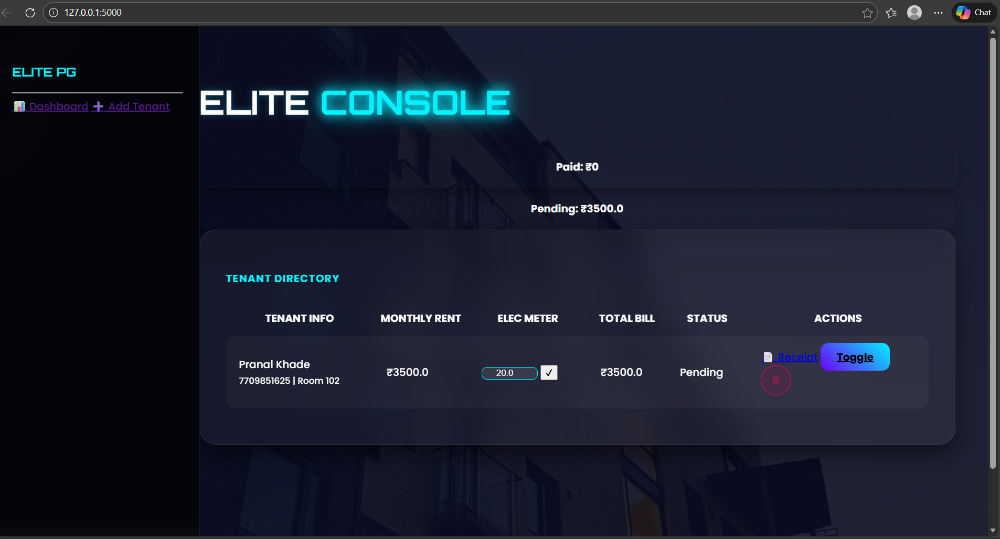
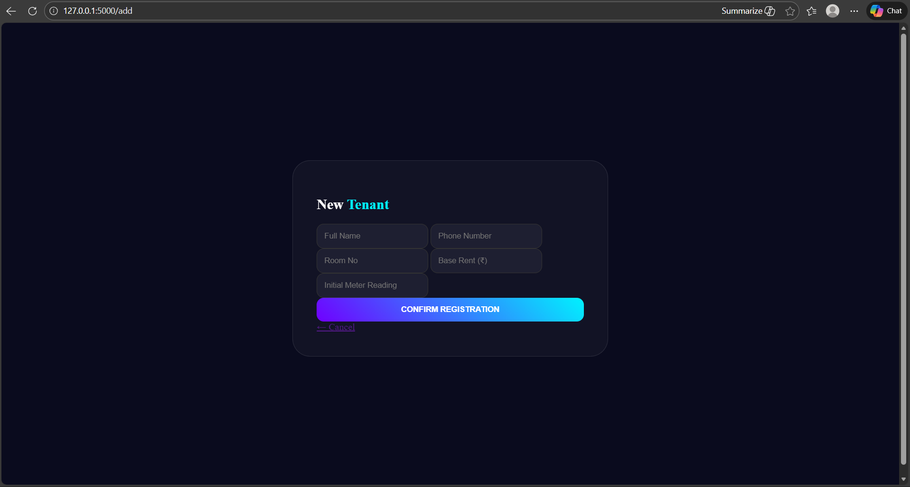

# 🏠 Elite PG Manager (Premium Console)

Elite PG Manager is a high-end, futuristic ERP solution for property owners to manage tenants, calculate electricity bills, and generate professional rent receipts. Built with **Python Flask** and **SQLite**, it features a modern **Glassmorphism UI** with glowing neon animations.

## 🌟 Key Features
- **Aesthetic Dashboard:** Neon-themed interface with a moving "Elite Console" heading.
- **Smart Electricity Calculator:** Automatic bill calculation based on meter readings.
- **PDF Receipt Generator:** Downloadable professional rent receipts for every transaction.
- **Financial Tracking:** Real-time visibility of Total Paid vs. Pending rent.
- **Responsive Management:** Add, update, or remove tenants with a single click.

## 📸 Screenshots



## 🛠️ Tech Stack
- **Backend:** Python 3, Flask, SQLAlchemy (SQLite)
- **Frontend:** HTML5, CSS3, Bootstrap 5, Animate.css
- **Design:** Glassmorphism, Neon Glow Animations
- **Libraries:** ReportLab (for PDF generation)

## 🚀 Installation & Setup
1. Clone the repository:
   ```bash
   git clone [https://github.com/durgeshkhade07-sudo/Elite-PG-Manager.git](https://github.com/durgeshkhade07-sudo/Elite-PG-Manager.git)
